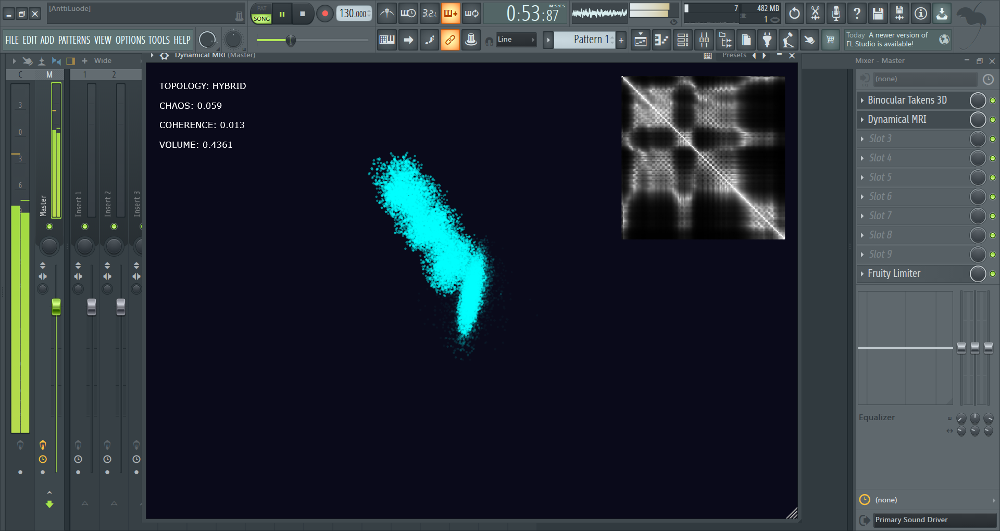

# Dynamical MRI 🌀
**A Topological Audio Microscope (VST3 for build / Built folder)**



Dynamical MRI is an experimental audio visualization plugin built with JUCE. Instead of analyzing sound by frequency (like a standard FFT or Spectrogram), it treats your audio as a **living dynamical system** and visualizes the physical "shape" of the sound in real-time.

Using Multi-Tau Takens Delay Embedding, it reconstructs hidden phase-space geometries from stereo audio. It doesn't just show volume—it reveals rhythm, phase, chaos, and stability.

 

## ✨ Features
* **Multi-Layer Temporal Embedding:** Visualizes multiple time-delay (τ) layers simultaneously to show fast transients and slow rhythms at the same time.
* **Real-time Topology Analysis:** Automatically classifies the geometric state of the audio (e.g., `TORUS` for periodic tones, `CHAOTIC` for noise/transients, `COLLAPSED` for silence).
* **Recurrence Matrix Plot:** A real-time 2D grid that reveals hidden repeating structures, rhythmic loops, and phase resets.
* **Dynamical Metrics:** Computes live metrics for Chaos (divergence), Coherence, and Attractor Volume.
* **3D Phase Space:** Renders the relationship between Left, Right, and Delayed channels in a rotatable 3D projection.

## 🧠 How to Read the Interface
* **The 3D Cloud:** Clean, periodic sounds (like a sine wave) form smooth rings or tubes (a Torus). Noisy sounds and harsh transients scatter into chaotic clouds. The color indicates the level of chaos (Cyan = Stable, Red = Chaotic).
* **The Recurrence Matrix (Top Right):** This grid shows Time vs. Time. A bright white diagonal line is the present. Parallel lines indicate distinct musical rhythms or pitches. Checkerboard patterns indicate sustained drones, chords, or reverb tails.

## 🛠️ How to Build (CMake)

You will need [CMake](https://cmake.org/) and a C++17 compatible compiler (Visual Studio / Xcode / GCC).

1. **Clone the repository and JUCE:**
   ```bash
   git clone <your-repo-url> DynamicalMRI
   cd DynamicalMRI
   git clone https://github.com/juce-framework/JUCE.git
   ```

2. **Generate the build files:**
```bash
cmake -B build
```

3. **Build the plugin:**
```bash
cmake --build build --config Release
```

4. **Find your plugin:**
Once built, the `.vst3` file and Standalone `.exe`/`.app` will be located in the `build/DynamicalMRI_artefacts/Release/` directory.
*(Note: The CMake configuration is set to automatically copy the VST3 to your system's default VST3 folder upon a successful build).*

## 🧪 Built With

* JUCE Framework - Audio plugin framework.
* C++17

## 📝 License

MIT License (or whatever license you choose to use).

